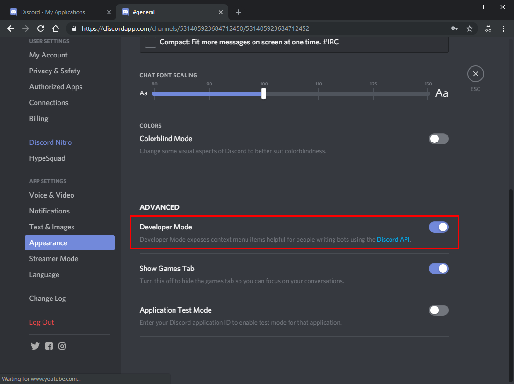
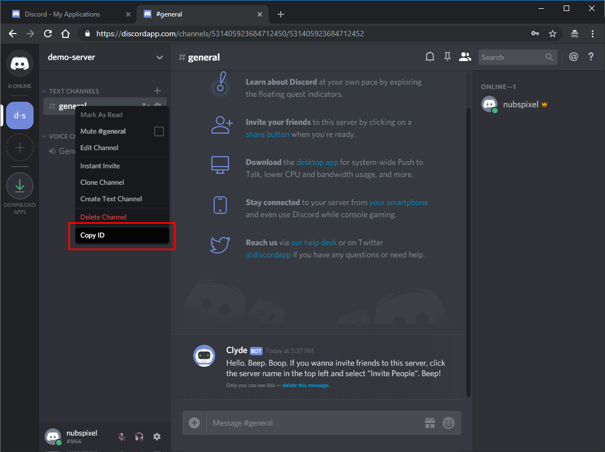
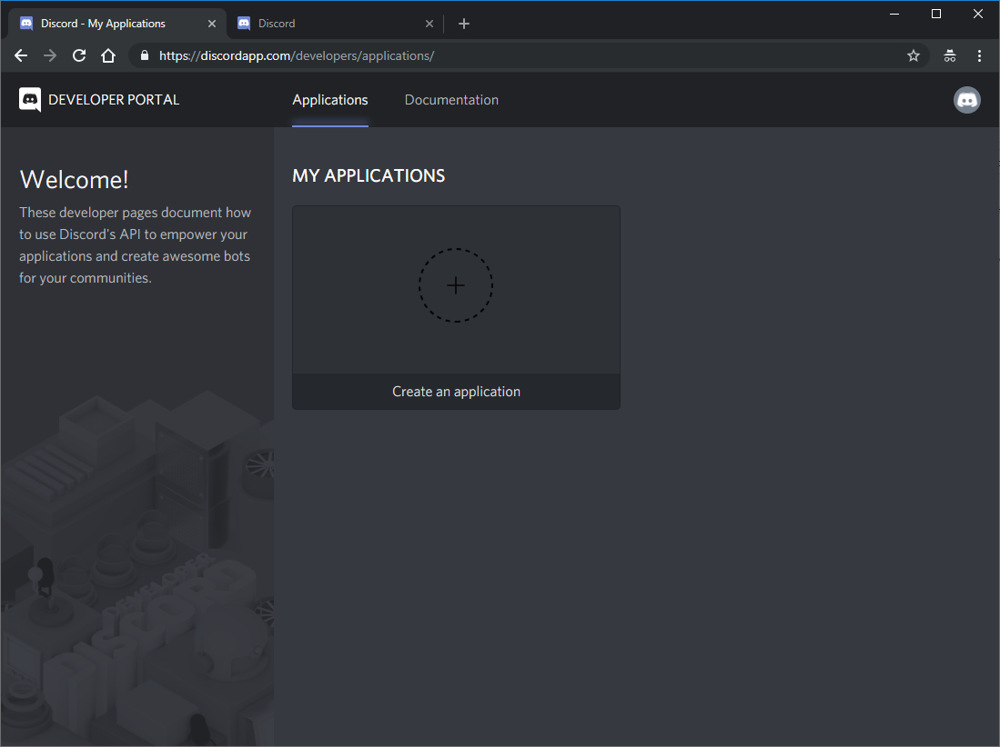
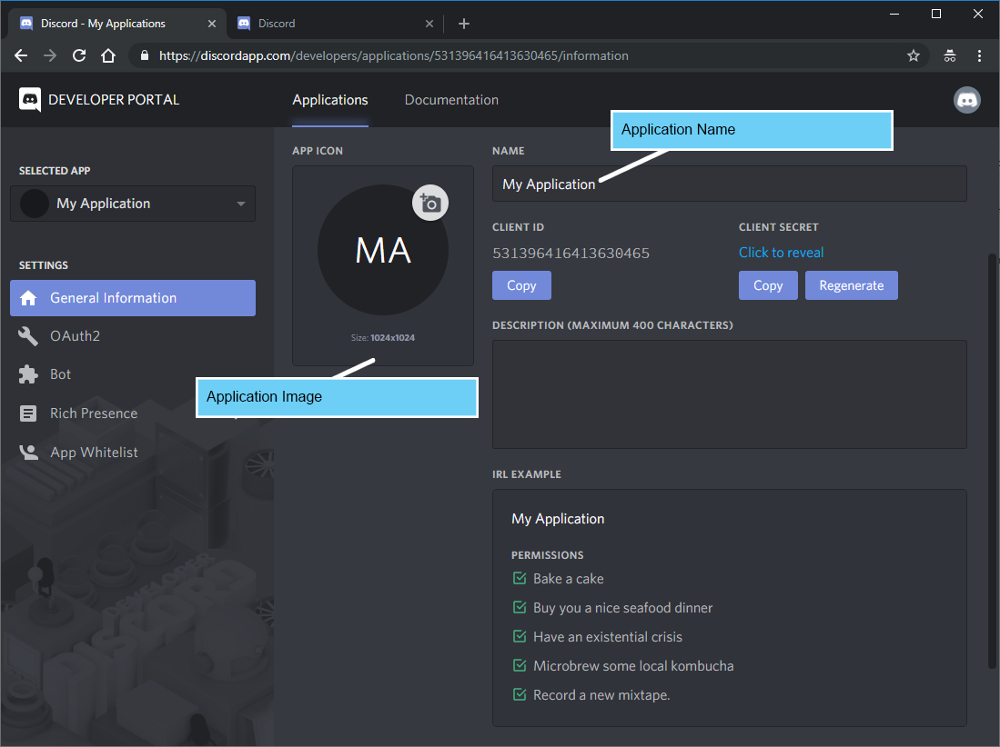
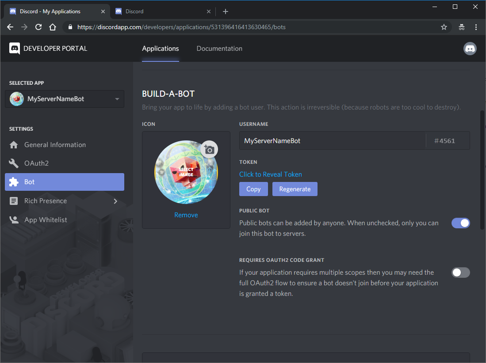
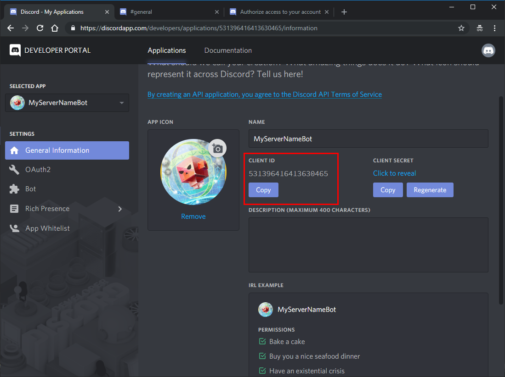
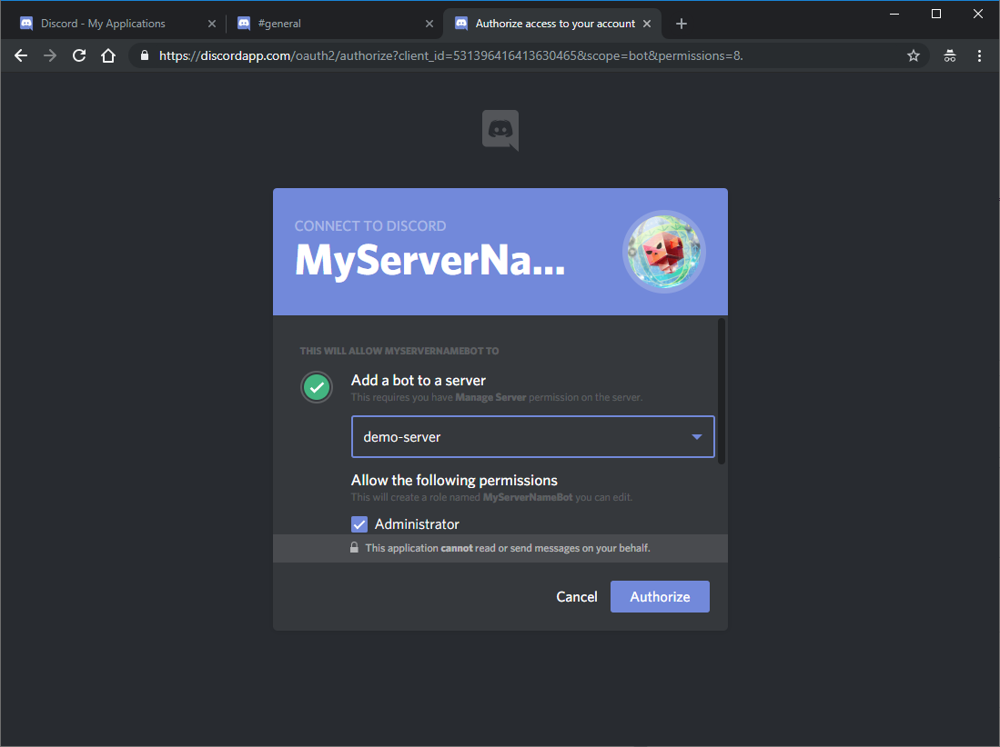
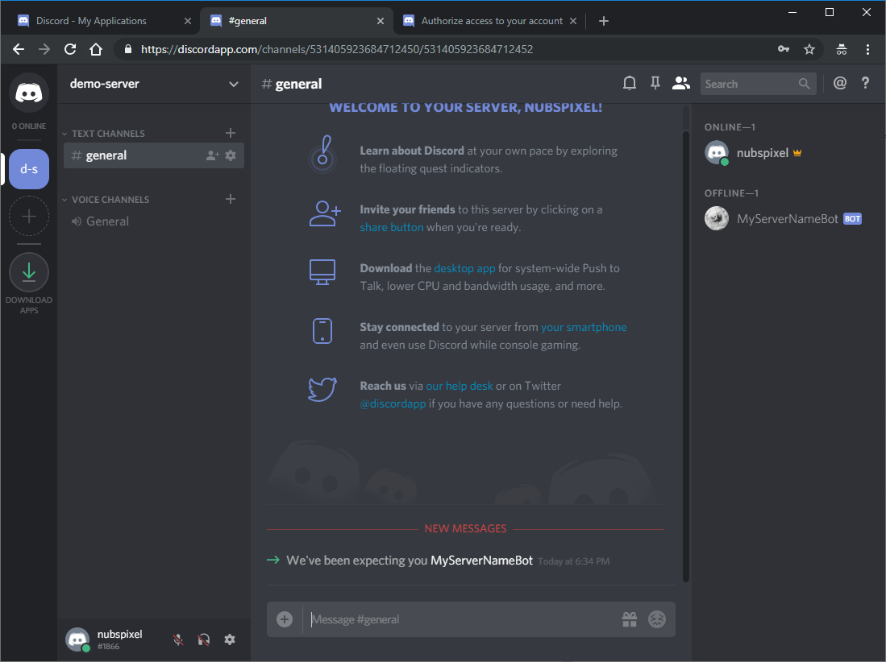

# Discord Bot Setup
Please follow the instruction bellow:

1. Login or Register Account at [discordapp.com](https://discordapp.com/)
2. Create a new discord server as shown [here](https://www.howtogeek.com/364075/how-to-create-set-up-and-manage-your-discord-server/). Add a new channel as needed.
3. Open **User Settings** -> **Appearance** -> Enable _Developer Mode_.


4. Copy the channel's ID and paste it into your `conf/discord/config.json` channels' general node value.

```json
{
    "version": 1,
    "debug": 0,
    "display_name": "roCORD",
    "token": "NDY4NTM2MTUyNjE4Njk2NzA4.DpWT3w.p0CGUK72FSvt0qcKr8XwtsmCdNE",
    "presence": "by Normynator",
    "channels" : {
        "general": "399436421378493102"
    }
}
```
5. Open your rAthena file `<rAthena path>/conf/channels.conf`. The default configuration is displayed below. Take note of name values.
```
{
		name: "#global"
		alias: "[Global]"
		color: "White"
		type: "CHAN_TYPE_PUBLIC"
		delay: 1000
		autojoin: false
		leave: false
	},
	{
		name: "#support"
		alias: "[Support]"
		color: "Blue"
		type: "CHAN_TYPE_PUBLIC"
		delay: 1000
		autojoin: false
	},
	{
		name: "#trade"
		alias: "[Trade]"
		color: "LightGreen"
		type: "CHAN_TYPE_PUBLIC"
		delay: 1000
		autojoin: false
	}
```
  
6. Copy-n-paste the name values without the hashtag symbol into roCORD configurations. Also, copy-n-paste other channel's ID you want to link from your server. Example is displayed below.
```json
{
    "version": 1,
    "debug": 0,
    "display_name": "roCORD",
    "token": "NDY4NTM2MTUyNjE4Njk2NzA4.DpWT3w.p0CGUK72FSvt0qcKr8XwtsmCdNE",
    "presence": "by Normynator",
    "channels" : {
        "global": "399436421378493102",
        "support": "935777022684940731",
        "trade": "408379299268642365"
    }
}
```

7. Next, we will need to create the bot. Open the Discord's [Developer Portal](https://discordapp.com/developers/applications/)


6. Click **Create Application**.
7. Enter the name of your application and change the application image as needed. Please make sure you save changes before proceeding to the next step.


8. Click **Bot** -> **Add Bot**. Then, confirm the creation of a new bot.
9. Enter the name of your bot and change the bot avatar image as needed. Please make sure you save changes before proceeding to the next step.


10. Edit the _display_name_ in your `conf/discord/config.json` to the same value you set the name of your bot.
11. Under the _Token_ label,  Click **Copy**. Paste this into your `conf/discord/config.json` token node value.
```json
{
    "version": 1,
    "debug": 0,
    "display_name": "MyServerNameBot",
    "token": "NTMxMzk2NDE2NDEzNjMwNDY1.DxNaEg.k1kdMivZ5nalvW-r2tor73Nl0pU",
    "presence": "by Normynator",
    "channels" : {
        "global": "399436421378493102",
        "support": "935777022684940731",
        "trade": "408379299268642365"
    }
}
```
11. For the next step, you will require to get your Application Client ID. You can obtain from the **General Information** -> **Client ID** -> **Copy**.



12. Copy the link below into a notepad. Then change the <Application_Client_ID> with the Application Client ID. Copy and paste this url into your browser to _invite_ your newly created bot into your Discord server.
```
https://discordapp.com/oauth2/authorize?client_id=<Application_Client_ID>&scope=bot&permissions=8.
```


13. Select the discord server you want to add the bot to and authorize it's access. You should be able to see the bot in your Server Channel.



